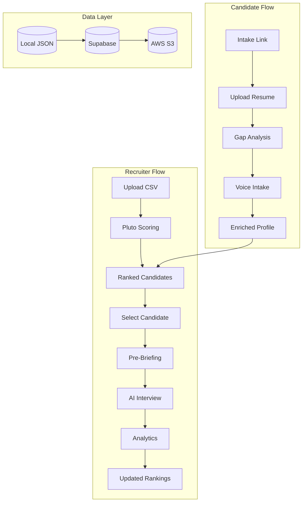

# Superposition Integration Overview

## Executive Summary

This document outlines the integration of **Pluto** (candidate scoring) with **Superposition** (interview platform) into a unified AI-powered recruiting system.

## System Architecture

## Implementation Phases

| Phase | Focus | Duration | Dependencies |
|-------|-------|----------|--------------|
| [Phase 1](./01_phase1_recruiter_flow.md) | Recruiter Core Flow | ~3 days | None |
| [Phase 2](./02_phase2_candidate_intake.md) | Candidate Intake | ~2 days | Phase 1 |
| [Phase 3](./03_phase3_persistence.md) | Database Integration | ~2 days | Phase 1, 2 |
| [Phase 4](./04_phase4_analytics_dashboard.md) | Reporting & Analytics | ~2 days | Phase 3 |

## Key Decisions

1. **Voice Engine**: OpenAI Realtime API for interviewer-side (AI plays candidate)
2. **Voice Engine**: LiveKit for candidate-side intake (AI interviews candidate)
3. **Persistence**: Local JSON → Supabase → AWS S3 (tiered approach)
4. **Backend**: Single FastAPI server (merged Pluto into Superposition)

## Quick Links

- [Database Schema](./05_database_schema.md)
- [API Endpoints](./06_api_endpoints.md)
- [Frontend Routes](./07_frontend_routes.md)
