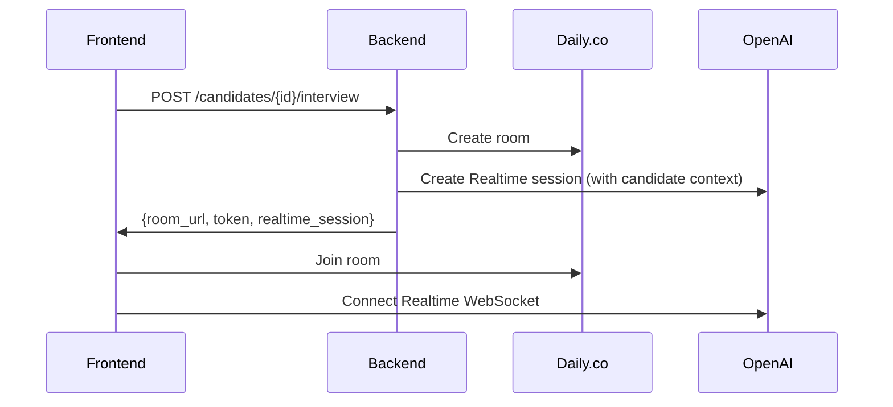

# Phase 1: Recruiter Core Flow

## Goal
Integrate Pluto scoring with the interview platform so recruiters can:
1. Score candidates → 2. Prepare for interview → 3. Conduct AI interview → 4. Get analytics

## User Journey

```
Upload CSV → Score → Select Candidate → Pre-Brief → Interview → Debrief → Updated Ranking
```

---

## 1.1 Merge Pluto Backend into Superposition

### Current State
- `/Superposition/backend/` - Main FastAPI server with rooms, prebrief, analytics
- `/Superposition/Pluto/backend/server.py` - Separate scoring server

### Target State
- Single backend at `/Superposition/backend/`
- Pluto logic moved to `/backend/routers/pluto.py` and `/backend/services/pluto_processor.py`

### Tasks
- [x] Migrate Pluto endpoints (already done in previous work)
- [ ] Migrate LiveKit agent setup for intake
- [ ] Add interview questions endpoint integration
- [ ] Add candidate detail endpoint with full profile

---

## 1.2 Pre-Briefing Integration

### New Endpoint
```python
GET /api/pluto/candidates/{candidate_id}/prebrief
```

### Logic
1. Fetch candidate from `candidates.json`
2. Fetch active job description
3. Call existing `/prebrief` logic with candidate resume + JD
4. Cache result in `data/prebriefs/{candidate_id}.json`
5. Return `PreInterviewBrief` object

### Frontend Route
```
/candidates/{id}/prebrief → PreBriefingScreen component
```

---

## 1.3 Interview Room Creation

### New Endpoint
```python
POST /api/pluto/candidates/{candidate_id}/interview
```

### Request Body
```json
{
  "interviewer_name": "string",
  "use_prebrief": true
}
```

### Logic
1. Create Daily.co room
2. Generate OpenAI Realtime session with candidate context:
   - Name, resume summary from Pluto data
   - Role from job description
   - Pre-brief analysis (if loaded)
3. Return room URL + tokens

### Data Flow


---

## 1.4 Interview Conduct

### Components Used
- `VideoRoom` - Daily.co video/audio
- `RealtimeVoice` - OpenAI Realtime audio (AI as candidate)
- `ChatAssistant` - Right panel for notes/questions

### Transcript Capture
- OpenAI Realtime provides transcription
- Store incrementally in session state
- Save to file on interview end

---

## 1.5 Post-Interview Analytics

### Trigger
When interviewer clicks "End Interview"

### Logic
1. Get full transcript from session
2. Call `/analytics/{room_name}` with:
   - Transcript
   - Job description
   - Resume
3. Store result in `data/analytics/{candidate_id}/{timestamp}.json`
4. Update candidate record:
   ```python
   candidate.interview_status = "completed"
   candidate.latest_interview_id = interview_id
   candidate.interview_score = analytics.overall_score
   ```

### UI
- Show `DebriefScreen` with analytics summary
- Display: strengths, improvements, recommendation
- Button: "Return to Rankings"

---

## 1.6 Updated Rankings View

### Changes
1. Add column: "Interview Status" (badge: ✓ Interviewed / Pending)
2. Add column: "Interview Score" (if interviewed)
3. Filter: "Show Interviewed Only"
4. Sort by: Combined score (algo + AI + interview)

---

## Files to Create/Modify

### Backend
| File | Action | Description |
|------|--------|-------------|
| `routers/pluto.py` | MODIFY | Add prebrief, interview, analytics endpoints |
| `services/interview_service.py` | CREATE | Handle interview session lifecycle |
| `models/interview.py` | CREATE | Interview session models |

### Frontend
| File | Action | Description |
|------|--------|-------------|
| `app/candidates/[id]/page.tsx` | CREATE | Candidate detail page |
| `app/candidates/[id]/prebrief/page.tsx` | CREATE | Pre-briefing screen |
| `app/candidates/[id]/interview/page.tsx` | CREATE | Interview room |
| `components/candidate-detail.tsx` | CREATE | Full candidate profile view |

---

## Success Criteria

- [ ] Can click candidate → see full profile
- [ ] Can generate pre-brief for any candidate
- [ ] Can start interview with AI playing candidate
- [ ] Interview transcript is captured
- [ ] Analytics are auto-generated on end
- [ ] Candidate status updates after interview
