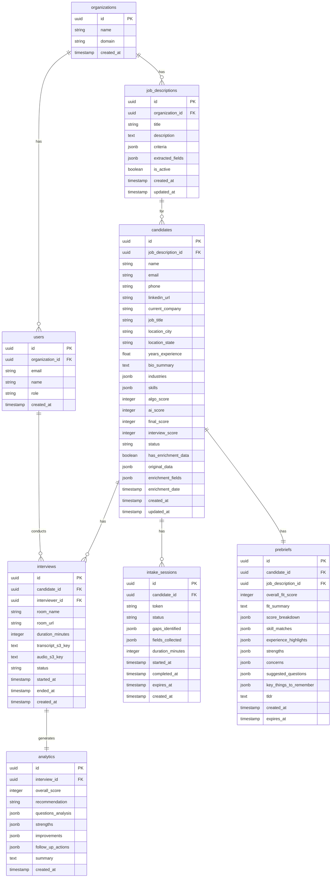

# Database Schema

## Entity Relationship Diagram



---

## Table Definitions

### organizations
Multi-tenant root entity.

| Column | Type | Constraints | Description |
|--------|------|-------------|-------------|
| id | UUID | PK, DEFAULT uuid_generate_v4() | |
| name | VARCHAR(255) | NOT NULL | Company name |
| domain | VARCHAR(255) | UNIQUE | e.g., "acme.com" |
| created_at | TIMESTAMPTZ | DEFAULT now() | |

---

### users
Recruiters/interviewers.

| Column | Type | Constraints | Description |
|--------|------|-------------|-------------|
| id | UUID | PK | |
| organization_id | UUID | FK → organizations.id | |
| email | VARCHAR(255) | UNIQUE, NOT NULL | |
| name | VARCHAR(255) | NOT NULL | |
| role | VARCHAR(50) | | admin, recruiter, viewer |
| created_at | TIMESTAMPTZ | DEFAULT now() | |

---

### job_descriptions
Job postings with extracted criteria.

| Column | Type | Constraints | Description |
|--------|------|-------------|-------------|
| id | UUID | PK | |
| organization_id | UUID | FK → organizations.id | |
| title | VARCHAR(255) | NOT NULL | Job title |
| description | TEXT | NOT NULL | Full JD text |
| criteria | JSONB | | Extracted scoring criteria |
| extracted_fields | JSONB | | Dynamic fields from JD |
| is_active | BOOLEAN | DEFAULT true | |
| created_at | TIMESTAMPTZ | DEFAULT now() | |
| updated_at | TIMESTAMPTZ | | |

**criteria JSONB structure:**
```json
{
  "required": ["5+ years SaaS sales", "Enterprise experience"],
  "preferred": ["Fintech background", "Quota attainment > 100%"],
  "red_flags": ["Job hopping", "No closing experience"]
}
```

---

### candidates
Main candidate records with scoring.

| Column | Type | Constraints | Description |
|--------|------|-------------|-------------|
| id | UUID | PK | |
| job_description_id | UUID | FK → job_descriptions.id | |
| name | VARCHAR(255) | NOT NULL | |
| email | VARCHAR(255) | | |
| phone | VARCHAR(50) | | |
| linkedin_url | TEXT | | |
| current_company | VARCHAR(255) | | |
| job_title | VARCHAR(255) | | |
| location_city | VARCHAR(100) | | |
| location_state | VARCHAR(50) | | |
| years_experience | DECIMAL(4,1) | | |
| bio_summary | TEXT | | AI-generated summary |
| industries | JSONB | | Array of industry strings |
| skills | JSONB | | Array of skill strings |
| algo_score | INTEGER | CHECK (0-100) | Algorithmic score |
| ai_score | INTEGER | CHECK (0-100) | AI reasoning score |
| final_score | INTEGER | CHECK (0-100) | Combined score |
| interview_score | INTEGER | CHECK (0-100) | Post-interview score |
| status | VARCHAR(50) | DEFAULT 'uploaded' | Pipeline status |
| has_enrichment_data | BOOLEAN | DEFAULT false | From intake agent |
| original_data | JSONB | | Snapshot before enrichment |
| enrichment_fields | JSONB | | Which fields were enriched |
| enrichment_date | TIMESTAMPTZ | | |
| created_at | TIMESTAMPTZ | DEFAULT now() | |
| updated_at | TIMESTAMPTZ | | |

**status enum values:**
- `uploaded` - Just added from CSV
- `algo_scored` - Has algorithmic score
- `ai_scored` - Has AI score
- `prebriefed` - Pre-brief generated
- `interviewed` - Interview completed
- `analyzed` - Analytics generated
- `hired` - Final outcome
- `rejected` - Final outcome
- `archived` - Moved to cold storage

---

### interviews
Interview session records.

| Column | Type | Constraints | Description |
|--------|------|-------------|-------------|
| id | UUID | PK | |
| candidate_id | UUID | FK → candidates.id | |
| interviewer_id | UUID | FK → users.id | |
| room_name | VARCHAR(100) | UNIQUE | Daily.co room name |
| room_url | TEXT | | Full room URL |
| duration_minutes | INTEGER | | |
| transcript_s3_key | TEXT | | S3 path to transcript |
| audio_s3_key | TEXT | | S3 path to recording |
| status | VARCHAR(50) | | scheduled, in_progress, completed, cancelled |
| started_at | TIMESTAMPTZ | | |
| ended_at | TIMESTAMPTZ | | |
| created_at | TIMESTAMPTZ | DEFAULT now() | |

---

### analytics
Post-interview AI analysis.

| Column | Type | Constraints | Description |
|--------|------|-------------|-------------|
| id | UUID | PK | |
| interview_id | UUID | FK → interviews.id, UNIQUE | |
| overall_score | INTEGER | CHECK (0-100) | |
| recommendation | VARCHAR(50) | | strong_hire, hire, maybe, no |
| questions_analysis | JSONB | | Per-question breakdown |
| strengths | JSONB | | Array of strength objects |
| improvements | JSONB | | Array of improvement objects |
| follow_up_actions | JSONB | | Suggested next steps |
| summary | TEXT | | Overall summary text |
| created_at | TIMESTAMPTZ | DEFAULT now() | |

---

### prebriefs
Cached pre-interview briefings.

| Column | Type | Constraints | Description |
|--------|------|-------------|-------------|
| id | UUID | PK | |
| candidate_id | UUID | FK → candidates.id | |
| job_description_id | UUID | FK → job_descriptions.id | |
| overall_fit_score | INTEGER | CHECK (0-100) | |
| fit_summary | TEXT | | One-line summary |
| score_breakdown | JSONB | | Technical, leadership, etc. |
| skill_matches | JSONB | | Array of skill match objects |
| experience_highlights | JSONB | | Key experience items |
| strengths | JSONB | | Array of strength objects |
| concerns | JSONB | | Array of concern objects |
| suggested_questions | JSONB | | Interview questions |
| key_things_to_remember | JSONB | | Quick reference points |
| tldr | TEXT | | Executive summary |
| created_at | TIMESTAMPTZ | DEFAULT now() | |
| expires_at | TIMESTAMPTZ | | For cache invalidation |

---

### intake_sessions
Candidate-side intake tracking.

| Column | Type | Constraints | Description |
|--------|------|-------------|-------------|
| id | UUID | PK | |
| candidate_id | UUID | FK → candidates.id | |
| token | VARCHAR(255) | UNIQUE | Secure access token |
| status | VARCHAR(50) | | pending, in_progress, completed, expired |
| gaps_identified | JSONB | | What needs to be filled |
| fields_collected | JSONB | | What was collected |
| duration_minutes | INTEGER | | |
| started_at | TIMESTAMPTZ | | |
| completed_at | TIMESTAMPTZ | | |
| expires_at | TIMESTAMPTZ | | Token expiration |
| created_at | TIMESTAMPTZ | DEFAULT now() | |

---

## Indexes

```sql
-- Frequently queried
CREATE INDEX idx_candidates_jd_id ON candidates(job_description_id);
CREATE INDEX idx_candidates_status ON candidates(status);
CREATE INDEX idx_candidates_final_score ON candidates(final_score DESC);

-- Foreign keys
CREATE INDEX idx_interviews_candidate_id ON interviews(candidate_id);
CREATE INDEX idx_analytics_interview_id ON analytics(interview_id);
CREATE INDEX idx_prebriefs_candidate_id ON prebriefs(candidate_id);
CREATE INDEX idx_intake_token ON intake_sessions(token);

-- Composite for common queries
CREATE INDEX idx_candidates_jd_status ON candidates(job_description_id, status);
```

---

## Row-Level Security (RLS)

```sql
-- Enable RLS
ALTER TABLE candidates ENABLE ROW LEVEL SECURITY;

-- Users can only see candidates in their organization
CREATE POLICY candidates_org_policy ON candidates
  USING (
    job_description_id IN (
      SELECT id FROM job_descriptions 
      WHERE organization_id = auth.organization_id()
    )
  );
```

---

## Migration Files

```
supabase/migrations/
├── 20241212_001_create_organizations.sql
├── 20241212_002_create_users.sql
├── 20241212_003_create_job_descriptions.sql
├── 20241212_004_create_candidates.sql
├── 20241212_005_create_interviews.sql
├── 20241212_006_create_analytics.sql
├── 20241212_007_create_prebriefs.sql
├── 20241212_008_create_intake_sessions.sql
├── 20241212_009_create_indexes.sql
└── 20241212_010_enable_rls.sql
```
