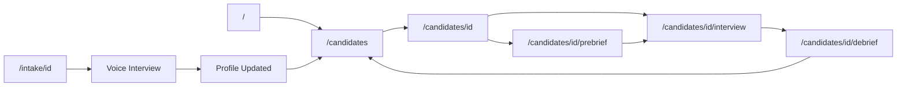

# Frontend Routes

## Route Structure

```
/                           → Landing / CSV Upload
/candidates                 → Ranked candidates list
/candidates/[id]            → Candidate detail
/candidates/[id]/prebrief   → Pre-briefing screen
/candidates/[id]/interview  → Interview room
/candidates/[id]/debrief    → Post-interview analytics
/room/[name]                → Join existing room (by link)
/intake/[id]                → Candidate intake (public)
/dashboard                  → Analytics dashboard
```

---

## Page Components

### `/` - Home / Upload
**Component**: `app/page.tsx`

**Features**:
- CSV upload dropzone
- Processing status display
- Progress bar (extraction → scoring)
- Quick navigation to results

---

### `/candidates` - Rankings List
**Component**: `app/candidates/page.tsx`

**Features**:
- Sortable table of candidates
- Columns: Rank, Name, Title, Scores, Status
- Filters: Status, Score range
- Actions: View, Interview, Compare
- Bulk actions: Export, Archive

**State**:
```typescript
interface CandidatesPageState {
  candidates: Candidate[];
  sortColumn: string;
  sortDirection: "asc" | "desc";
  filters: {
    status?: string;
    minScore?: number;
  };
  selectedIds: string[];
}
```

---

### `/candidates/[id]` - Candidate Detail
**Component**: `app/candidates/[id]/page.tsx`

**Features**:
- Full profile display
- Score breakdown cards
- Pros/cons/red flags
- Interview history
- Action buttons:
  - [Prepare Interview] → Pre-brief
  - [Quick Interview] → Direct to room
  - [Send Intake Link] → Generate link

**Sections**:
1. Header (name, title, company, location)
2. Score Cards (Algo, AI, Final, Interview)
3. Summary & Bio
4. Experience & Skills
5. AI Analysis (pros, cons, red flags)
6. Interview Questions
7. Activity Timeline

---

### `/candidates/[id]/prebrief` - Pre-Briefing
**Component**: `app/candidates/[id]/prebrief/page.tsx`

**Features**:
- Fit score with breakdown
- Skill match cards
- Experience highlights
- Strengths & concerns
- Suggested questions (interactive checklist)
- TLDR summary
- [Start Interview] button

---

### `/candidates/[id]/interview` - Interview Room
**Component**: `app/candidates/[id]/interview/page.tsx`

**Layout**:
```
┌─────────────────────────────────────────────────────────────┐
│  Header: Candidate Name | Timer | [End Interview]          │
├───────────────────────────────────┬─────────────────────────┤
│                                   │                         │
│   Video / Audio Controls          │   Chat Assistant        │
│   (Daily.co + OpenAI Realtime)    │   Suggested Questions   │
│                                   │   Notes                 │
│                                   │                         │
├───────────────────────────────────┴─────────────────────────┤
│  Transcript (live, scrolling)                               │
└─────────────────────────────────────────────────────────────┘
```

**Features**:
- Daily.co video/audio
- OpenAI Realtime (AI as candidate)
- Chat panel for assistant
- Live transcript display
- Timer
- Notes capture

---

### `/candidates/[id]/debrief` - Post-Interview
**Component**: `app/candidates/[id]/debrief/page.tsx`

**Features**:
- Overall score & recommendation
- Question-by-question analysis
- Strengths identified
- Areas for improvement
- Follow-up suggestions
- Full transcript viewer
- [Return to Rankings] button

---

### `/room/[name]` - Join Room (Shareable)
**Component**: `app/room/[name]/page.tsx`

**Features**:
- Name entry form
- Role selection (interviewer/candidate)
- Join button
- Room info display

---

### `/intake/[id]` - Candidate Intake
**Component**: `app/intake/[id]/page.tsx`

**Steps**:
1. Token validation
2. Resume data display
3. Gap identification
4. Voice interview start
5. Live field updates
6. Completion confirmation

**Features**:
- Progress stepper
- Voice connection status
- Real-time field updates
- Completion summary

---

### `/dashboard` - Analytics Dashboard
**Component**: `app/dashboard/page.tsx`

**Features**:
- Pipeline funnel chart
- Candidate leaderboard
- Interview insights
- Time-based trends
- Export options

---

## Shared Components

| Component | Usage |
|-----------|-------|
| `CandidateCard` | Card view of candidate |
| `ScoreRing` | Circular score display |
| `StatusBadge` | Pipeline status indicator |
| `QuestionList` | Checklist of interview Qs |
| `TranscriptViewer` | Formatted transcript |
| `ChatPanel` | AI assistant chat |
| `VideoRoom` | Daily.co integration |
| `RealtimeVoice` | OpenAI Realtime audio |

---

## Navigation Flow


